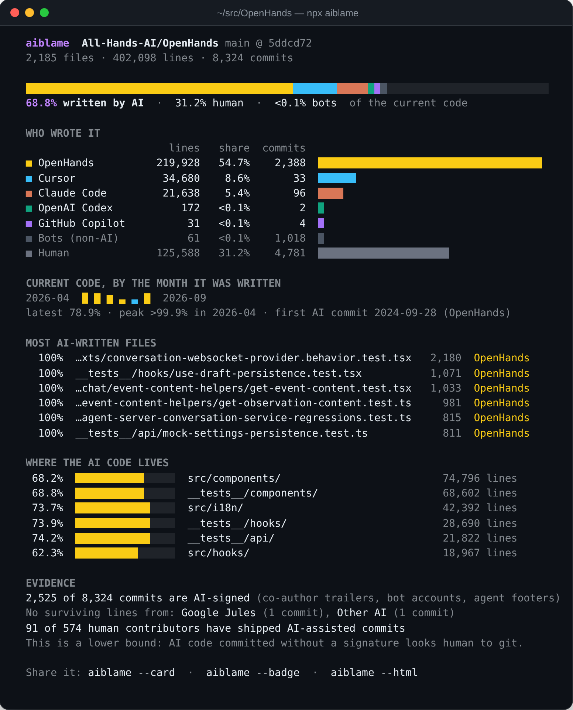
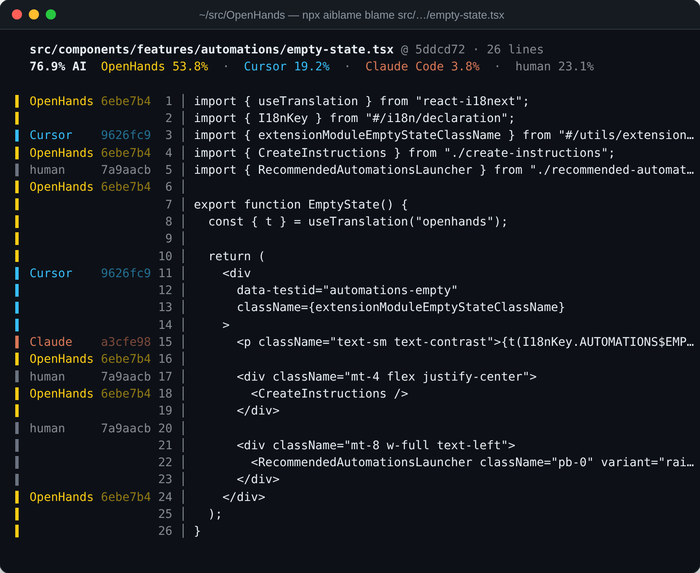
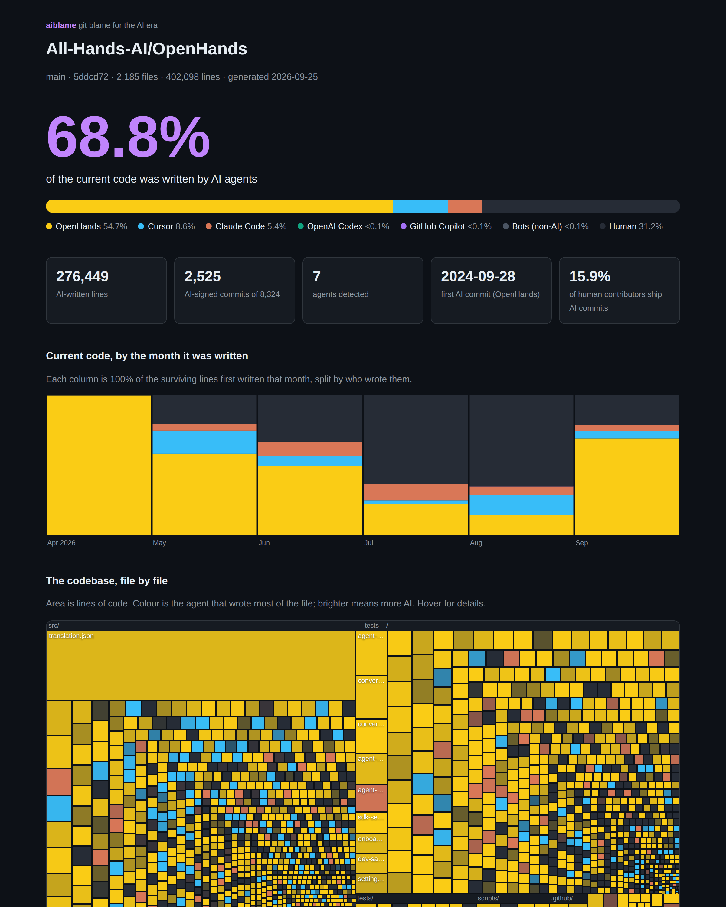

<div align="center">

# aiblame

**`git blame` for the AI era.**

How much of your code did Claude, Copilot, Cursor, Codex, Devin & friends *actually* write?<br>
One command. Any repo. Down to the line. No guessing.

English · [简体中文](README.zh-CN.md)


```sh
npx aiblame
```



</div>

---

AI agents now write a big share of the world's code, but nobody can say how much.
Commit counts lie (one agent commit can add 5,000 lines), and "AI detectors" guess from style.

**aiblame doesn't guess. It collects evidence.** Coding agents leave fingerprints: `Co-authored-by` trailers, bot accounts,
"Generated with…" footers, and session logs on your disk. aiblame collects those fingerprints, then runs `git blame` on every
line of your repo to find out who wrote the code that is still there *today*.

- **Line-level, not commit-level.** If a human rewrites an AI-written line, it counts as human again. Deleted code doesn't count at all.
- **Evidence you can audit.** `aiblame evidence` lists every signature it matched, with example commits.
- **Catches unsigned AI code (on your machine).** Committed Claude Code or Codex output without a trailer? aiblame can match those lines against the agents' local session transcripts.
- **Works on any repo, instantly.** Local path, git URL, or `owner/repo`. Nothing to install in the repo first.
- **Fast on huge repos.** 100k commits and 48k files take about 2 minutes (sampled, with a ±0.3% margin of error).
- **Zero dependencies.** One `npx` away. Everything runs locally, with no telemetry.

## Leaderboard: how AI-written is your favourite repo?

<!-- LEADERBOARD:START -->
<!-- LEADERBOARD:END -->

Want your repo on here? Run `npx aiblame --card` and show it off. (See [Put it in your README](#put-it-in-your-readme).)

## Usage

```sh
npx aiblame                        # the repo you're in
npx aiblame ~/code/my-app          # another local repo
npx aiblame facebook/react         # any GitHub repo (cloned to a temp dir)
npx aiblame --code                 # programming languages only: skip docs, config & data
npx aiblame blame src/index.ts     # line-by-line: who wrote each line?
npx aiblame evidence               # audit: which signatures matched, and how often
npx aiblame --html                 # a shareable, self-contained HTML report
```

Install globally (`npm i -g aiblame`) and it also works as a git subcommand: `git aiblame`.

### `aiblame blame <file>`

Like `git blame`, but the gutter tells you which agent wrote each line.



### `aiblame --html`

A single HTML file you can open, share or attach to a PR. It has a stacked timeline, a treemap of the whole codebase coloured by agent, and tables of files, directories and languages.



### All options

```text
Output
  --html [file]        self-contained HTML report      (default aiblame-report.html)
  --card [file]        SVG card for your README        (default aiblame-card.svg)
  --badge [file]       SVG badge for your README       (default aiblame-badge.svg)
  --shields [file]     shields.io endpoint JSON        (default aiblame-shields.json)
  --json [file]        full report as JSON (stdout unless a .json file is given)
  --label <text>       badge label                     (default "AI-written")
  --top <n>            rows per table                  (default 8)
  --quiet              skip the terminal report
  --no-color           plain output

Analysis
  --rev <rev>          analyze a branch, tag or commit (default HEAD)
  --fast               skip blame; count lines added across history instead
  --since <date>       with --fast: only commits since then ("90 days ago", 2026-01-01)
  --include <glob>     only analyze matching paths (repeatable)
  --exclude <glob>     skip matching paths (repeatable)
  --code               only programming languages: skip docs, config and data
  --all-files          keep lockfiles, vendored and generated files
  --no-transcripts     ignore local agent session logs
  --sample <n>         blame n random files and extrapolate (auto above 4,000 files)
  --full               blame every file, however big the repo
  --no-commit-graph    never write git's commit-graph cache (it makes blame ~5x faster)
  --jobs <n>           parallel git processes
  --max-ai <percent>   exit with code 3 if the AI share is above this (CI policy)
```

## Put it in your README

Two looks, both plain SVG files you commit next to your README. They follow GitHub's light/dark theme.

```sh
npx aiblame --card --badge --quiet
```

| `--card` | `--badge` |
|---|---|
|  |  |

```md

```

Want it always up to date? Use the GitHub Action.

## GitHub Action

Refresh the card on every push to `main`:

```yaml
# .github/workflows/aiblame.yml
name: aiblame
on:
  push:
    branches: [main]
permissions:
  contents: write
jobs:
  aiblame:
    runs-on: ubuntu-latest
    steps:
      - uses: actions/checkout@v5
        with:
          fetch-depth: 0 # blame needs the full history
      - uses: bobaoxu2001/openclaw/aiblame@main
        id: aiblame
        with:
          card: .github/aiblame-card.svg
          badge: .github/aiblame-badge.svg
      - run: |
          git config user.name "github-actions[bot]"
          git config user.email "41898282+github-actions[bot]@users.noreply.github.com"
          git add .github/aiblame-*.svg
          git diff --cached --quiet || git commit -m "Update aiblame card"
          git push
```

The action also writes a job summary and exposes `steps.aiblame.outputs.ai-share` (e.g. `41.3`).

### Enforce an AI-code policy

Some projects don't accept AI-generated code. Others cap it. `--max-ai` turns aiblame into a CI gate:

```yaml
      - uses: bobaoxu2001/openclaw/aiblame@main
        with:
          max-ai: 0 # fail if any signed AI code is present
```

## What counts as evidence

aiblame never guesses from coding style. A line is credited to an agent only when there is concrete evidence.

**1. Commit signatures.** These work on any clone of the repo. aiblame knows these agents:

| Agent | Signature |
|---|---|
| Claude Code | `Co-authored-by: Claude <noreply@anthropic.com>` trailer, "Generated with Claude Code" footer, `claude[bot]` |
| GitHub Copilot | Copilot coding agent commits, `Co-authored-by: Copilot` (accepted suggestions, Autofix) |
| Cursor | `Cursor Agent <cursoragent@cursor.com>` as author or co-author |
| OpenAI Codex | `Co-authored-by: Codex <noreply@openai.com>`, `chatgpt-codex-connector[bot]` |
| Aider | `(aider)` author suffix, `Co-authored-by: aider (<model>)`, legacy `aider:` prefix |
| Devin | `devin-ai-integration[bot]` |
| Google Jules | `google-labs-jules[bot]` |
| Gemini | `gemini-code-assist[bot]` suggestions, `gemini-cli[bot]` |
| Amp | `Co-authored-by: Amp <amp@ampcode.com>`, `Amp-Thread-ID:` trailer |
| OpenHands | `openhands <openhands@all-hands.dev>` |
| Factory Droid | `factory-droid[bot]` |
| opencode | `Co-authored-by: opencode`, "Generated with opencode" |
| Roo Code | `roomote[bot]`, `Co-authored-by: Roo Code` |
| Cline, Windsurf, Qwen Code, Warp, Crush, Kiro | their co-author trailers or bot accounts |
| Replit Agent | `Replit-Commit-Author: Agent` trailer |
| Lovable, v0, CodeRabbit, Sweep | their bot accounts |
| Other AI | generic trailers such as `Co-authored-by: GPT-5 <…>` or "Generated by AI" |

Non-AI automation (Dependabot, Renovate, `github-actions[bot]`, release bots…) is reported separately as **Bots**.
Run `npx aiblame agents` for the exact patterns.

Patterns match trailers and accounts, not names, so a colleague called Claude or Devin is never mistaken for an agent.
The test suite checks those cases.

**2. Local agent transcripts.** These only work on your machine. Coding agents log every file write and edit to disk.
aiblame reads the logs of Claude Code (`~/.claude/projects`), Codex (`~/.codex/sessions`), Gemini CLI, Qwen Code, opencode,
OpenClaw, Factory Droid, pi and Aider (`.aider.chat.history.md`). It indexes the lines those agents wrote into this repo.
When `git blame` pins such a line on a human commit that was made *after* the agent wrote it, the line goes back to the agent.
Transcripts are only read, never uploaded, and never copied into reports.

**Audit it.** Don't take our word for it:

```text
$ npx aiblame evidence openai/codex

  Signatures found in 11,404 commits

  ■ OpenAI Codex 351 commits
        338  Co-authored-by: Codex <noreply@openai.com>  e.g. 1013295
         11  Co-authored-by: Codex <199175422+chatgpt-codex-connector[bot]@users.noreply.github.com>  e.g. 855e275
  ■ Claude Code 10 commits
          5  Co-authored-by: Claude <noreply@anthropic.com>  e.g. b4a53ae
  …
```

## How it works

1. **List files** at `HEAD`, skipping binaries, lockfiles, vendored and generated code, and anything marked `linguist-generated` or `linguist-vendored`.
2. **Classify every commit** in one `git log` pass as an AI agent, a bot or a human.
3. **Blame every line** with `git blame -w`, so whitespace-only changes don't steal authorship. `.git-blame-ignore-revs` is honoured.
4. **Reclaim unsigned lines** from local transcripts, as described above.
5. **Roll up** by agent, file, directory, language and month.

On big repos, aiblame writes git's commit-graph cache with changed-path Bloom filters, which makes blame about 5x faster.
Above 4,000 files it blames a random sample and extrapolates, with a 95% margin of error on the headline number
(`~41.3% ±0.8%`). The sample is seeded by the commit hash, so the same commit always gives the same answer. Use `--full` to blame everything.

`--fast` skips blame and counts lines *added* per commit instead. Pair it with `--since "90 days ago"` to see how much of a repo's
*recent* work is AI-written.

## Accuracy and limitations

- **It's a lower bound.** AI code committed without a trailer looks human to git. That includes most local agent use with the trailer turned off, and all inline autocomplete.
  A repo can be heavily AI-assisted and still score low. If you want credit where it's due, keep your agent's co-author trailer on.
- **Signed commits count in full.** Every line of an AI-signed commit is credited to the agent, even lines a human tweaked before committing.
  That is the same convention Aider uses for its own stats. Later human edits do move lines back to the human.
- **Squash merges are fine.** GitHub keeps `Co-authored-by` trailers in squash commit messages.
- **Trailers are just text.** Anyone can add or strip them. aiblame measures what people disclose. It is not a forensic tool.
- **Shallow clones** blame every old line on the clone boundary. aiblame warns you. Use `fetch-depth: 0` in CI.

## Contributing

The most valuable contribution is a **new agent signature**. It takes three steps:

1. Add the pattern to [`src/agents.ts`](src/agents.ts). Match trailers, emails or bot accounts, never bare names.
2. Add a positive and a negative case to [`test/agents.test.mjs`](test/agents.test.mjs).
3. Run `npx aiblame evidence <some repo that uses the agent>` and check that every match is real.

```sh
npm install
npm test               # builds, then runs the unit and end-to-end tests
node dist/cli.js .     # try your build
```

The leaderboard above is reproducible with [`scripts/leaderboard.mjs`](scripts/leaderboard.mjs).

## Library

```js
import { analyze, renderCard } from "aiblame";

const report = await analyze({ path: "." });
console.log(report.totals.ai / report.totals.lines);
```

## License

MIT
