<div align="center">

# aiblame

**AI 时代的 `git blame`。**

你的代码里，到底有多少是 Claude、Copilot、Cursor、Codex、Devin 这些 AI 写的？<br>
一条命令，任意仓库，精确到每一行，不靠猜。

[English](README.md) · 简体中文


```sh
npx aiblame
```


</div>

---

AI 智能体已经在写世界上相当一部分代码，但没人说得清到底有多少。
按提交数算不准（一次 AI 提交可能加了 5000 行），"AI 代码检测器"又只是在根据风格猜。

**aiblame 不猜，只看证据。** 编程智能体会留下"指纹"：`Co-authored-by` 提交尾注、机器人账号、
"Generated with…" 页脚，以及你本机上的会话日志。aiblame 收集这些指纹，再对仓库里**每一行现存代码**跑 `git blame`，
算出*今天*还活着的代码是谁写的。

- **行级别，不是提交级别**：人类重写过的 AI 代码会重新算作人类的；已删除的代码不计入。
- **证据可审计**：`aiblame evidence` 列出每一条匹配到的签名和示例提交。
- **能找回没署名的 AI 代码**（仅限你的机器）：用 Claude Code / Codex 写完却没带尾注就提交了？aiblame 会拿这些行去比对智能体的本地会话记录。
- **任何仓库，开箱即用**：本地路径、git URL 或 `owner/repo` 都行，不需要事先在仓库里装任何东西。
- **大仓库也快**：10 万次提交、4.8 万个文件，大约 2 分钟（随机抽样，误差 ±0.3%）。
- **零依赖**：`npx` 即用，全部本地运行，没有任何遥测。

## 排行榜：热门仓库里有多少代码是 AI 写的？

<!-- LEADERBOARD:START -->


<details>
<summary>完整表格：全部 51 个仓库（含"仅代码"占比）</summary>

"Code only" 不计文档、配置和数据文件（`--code`）。`~` 表示基于随机抽样文件的估计值。

| Repository | AI-written | Code only | Top agents | AI-signed commits |
|---|---:|---:|---|---:|
| [All-Hands-AI/OpenHands](https://github.com/All-Hands-AI/OpenHands) | **68.7%** | 67.8% | OpenHands 54.6%, Cursor 8.6%, Claude Code 5.4% | 2,590 / 8,327 |
| [mastra-ai/mastra](https://github.com/mastra-ai/mastra) | **~44.9%** | ~54.3% | Mastra Code 31.4%, Claude Code 11.0%, Devin 1.6% | 3,513 / 20,039 |
| [anthropics/claude-code](https://github.com/anthropics/claude-code) | **32.7%** | 5.0% | Claude Code 32.7% | 73 / 878 |
| [RooCodeInc/Roo-Code](https://github.com/RooCodeInc/Roo-Code) | **30.0%** | 33.4% | Roo Code 22.6%, Claude Code 6.9%, GitHub Copilot 0.4% | 552 / 7,073 |
| [microsoft/vscode](https://github.com/microsoft/vscode) | **~29.4%** | ~31.7% | GitHub Copilot 29.2%, Claude Code 0.2% | 6,299 / 166,130 |
| [n8n-io/n8n](https://github.com/n8n-io/n8n) | **~25.7%** | ~28.1% | Claude Code 20.9%, Cursor 4.6%, OpenAI Codex 0.1% | 2,876 / 24,802 |
| [cli/cli](https://github.com/cli/cli) | **25.1%** | 24.0% | GitHub Copilot 25.1% | 601 / 12,202 |
| [charmbracelet/crush](https://github.com/charmbracelet/crush) | **21.7%** | 22.4% | Crush 20.7%, Claude Code 0.9%, GitHub Copilot 0.1% | 255 / 4,220 |
| [vllm-project/vllm](https://github.com/vllm-project/vllm) | **~21.5%** | ~22.5% | OpenAI Codex 11.2%, Claude Code 7.1%, Gemini 2.0% | 1,764 / 21,953 |
| [block/goose](https://github.com/block/goose) | **19.0%** | 12.9% | GitHub Copilot 14.3%, Claude Code 4.2%, Amp 0.4% | 267 / 5,731 |
| [Aider-AI/aider](https://github.com/Aider-AI/aider) | **16.9%** | 61.6% | Aider 16.9% | 5,947 / 13,138 |
| [openai/openai-agents-python](https://github.com/openai/openai-agents-python) | **15.2%** | 17.6% | OpenAI Codex 15.2% | 2 / 2,355 |
| [sst/opencode](https://github.com/sst/opencode) | **~9.6%** | ~11.6% | opencode 9.1%, GitHub Copilot 0.3%, Claude Code 0.1% | 1,868 / 15,794 |
| [excalidraw/excalidraw](https://github.com/excalidraw/excalidraw) | **6.9%** | 8.9% | Claude Code 6.9% | 8 / 4,096 |
| [cline/cline](https://github.com/cline/cline) | **6.4%** | 6.0% | Claude Code 4.3%, Cursor 1.4%, GitHub Copilot 0.7% | 155 / 7,434 |
| [better-auth/better-auth](https://github.com/better-auth/better-auth) | **6.2%** | 6.1% | Claude Code 3.3%, GitHub Copilot 1.7%, Cursor 1.1% | 159 / 7,623 |
| [vercel/ai](https://github.com/vercel/ai) | **~6.1%** | ~7.3% | Claude Code 4.8%, Cursor 1.2%, GitHub Copilot 0.1% | 242 / 8,683 |
| [denoland/deno](https://github.com/denoland/deno) | **~5.9%** | ~5.7% | Claude Code 5.7%, GitHub Copilot 0.1% | 429 / 17,368 |
| [oven-sh/bun](https://github.com/oven-sh/bun) | **~5.7%** | ~4.9% | Claude Code 5.7% | 714 / 18,252 |
| [biomejs/biome](https://github.com/biomejs/biome) | **~5.3%** | ~5.5% | CodeRabbit 3.1%, Claude Code 2.0%, GitHub Copilot 0.1% | 145 / 10,985 |
| [openai/codex](https://github.com/openai/codex) | **~5.0%** | ~4.9% | OpenAI Codex 5.0% | 364 / 11,404 |
| [modelcontextprotocol/typescript-sdk](https://github.com/modelcontextprotocol/typescript-sdk) | **4.3%** | 4.9% | Claude Code 3.0%, Cursor 0.8%, GitHub Copilot 0.6% | 80 / 1,618 |
| [supabase/supabase](https://github.com/supabase/supabase) | **~4.1%** | ~6.1% | Claude Code 2.8%, GitHub Copilot 0.7%, Cursor 0.4% | 518 / 38,735 |
| [continuedev/continue](https://github.com/continuedev/continue) | **3.5%** | 4.4% | Claude Code 3.4% | 242 / 21,569 |
| [astral-sh/uv](https://github.com/astral-sh/uv) | **3.1%** | 2.7% | Claude Code 1.5%, OpenAI Codex 1.4%, GitHub Copilot 0.2% | 159 / 10,636 |
| [google-gemini/gemini-cli](https://github.com/google-gemini/gemini-cli) | **2.8%** | 5.9% | Gemini 2.8% | 275 / 6,437 |
| [browser-use/browser-use](https://github.com/browser-use/browser-use) | **2.5%** | 3.0% | Claude Code 1.7%, Cursor 0.8% | 261 / 10,295 |
| [vitejs/vite](https://github.com/vitejs/vite) | **1.9%** | 1.7% | Claude Code 0.9%, GitHub Copilot 0.7%, OpenAI Codex 0.2% | 60 / 9,705 |
| [withastro/astro](https://github.com/withastro/astro) | **~1.9%** | ~2.3% | GitHub Copilot 1.5%, Claude Code 0.4% | 24 / 15,118 |
| [zed-industries/zed](https://github.com/zed-industries/zed) | **1.8%** | 1.9% | Claude Code 1.2%, Amp 0.2%, Cursor 0.2% | 142 / 40,134 |
| [ggml-org/llama.cpp](https://github.com/ggml-org/llama.cpp) | **1.6%** | 1.6% | GitHub Copilot 0.9%, Claude Code 0.7% | 34 / 11,181 |
| [tailwindlabs/tailwindcss](https://github.com/tailwindlabs/tailwindcss) | **1.3%** | 1.3% | Claude Code 1.3% | 12 / 6,848 |
| [langchain-ai/langchain](https://github.com/langchain-ai/langchain) | **1.2%** | 1.4% | Claude Code 0.9%, GitHub Copilot 0.3% | 44 / 16,852 |
| [vercel/next.js](https://github.com/vercel/next.js) | **~1.2%** | ~1.3% | Claude Code 1.1%, Cursor 0.1% | 231 / 35,862 |
| [openclaw/openclaw](https://github.com/openclaw/openclaw) | **~1.2%** | ~1.2% | Claude Code 0.7%, Amp 0.3%, GitHub Copilot 0.1% | 1,740 / 99,874 |
| [open-webui/open-webui](https://github.com/open-webui/open-webui) | **0.9%** | 0.8% | Claude Code 0.8% | 208 / 18,717 |
| [astral-sh/ruff](https://github.com/astral-sh/ruff) | **~0.8%** | ~1.0% | Claude Code 0.7%, OpenAI Codex 0.1% | 78 / 17,374 |
| [microsoft/playwright](https://github.com/microsoft/playwright) | **0.7%** | 0.6% | GitHub Copilot 0.5%, Claude Code 0.2% | 82 / 17,980 |
| [ghostty-org/ghostty](https://github.com/ghostty-org/ghostty) | **0.6%** | 0.7% | Claude Code 0.5% | 88 / 17,925 |
| [honojs/hono](https://github.com/honojs/hono) | **0.6%** | 0.5% | Claude Code 0.6% | 12 / 2,836 |
| [sveltejs/svelte](https://github.com/sveltejs/svelte) | **~0.6%** | ~0.4% | Claude Code 0.4%, GitHub Copilot 0.2% | 22 / 11,411 |
| [facebook/react](https://github.com/facebook/react) | **~0.6%** | ~0.6% | Claude Code 0.4%, Amp 0.1% | 35 / 21,708 |
| [shadcn-ui/ui](https://github.com/shadcn-ui/ui) | **~0.5%** | ~0.4% | Claude Code 0.4% | 62 / 2,459 |
| [neovim/neovim](https://github.com/neovim/neovim) | **0.2%** | 0.2% | Claude Code 0.2% | 57 / 38,230 |
| [badlogic/pi-mono](https://github.com/badlogic/pi-mono) | **0.2%** | 0.2% | Claude Code 0.1% | 15 / 6,531 |
| [fastapi/fastapi](https://github.com/fastapi/fastapi) | **<0.1%** | 0.2% | none found | 3 / 7,713 |
| [pydantic/pydantic](https://github.com/pydantic/pydantic) | **<0.1%** | <0.1% | none found | 4 / 5,758 |
| [ollama/ollama](https://github.com/ollama/ollama) | **<0.1%** | <0.1% | none found | 4 / 5,795 |
| [django/django](https://github.com/django/django) | **~0%** | ~0% | none found | 0 / 34,952 |
| [tauri-apps/tauri](https://github.com/tauri-apps/tauri) | **0%** | 0% | none found | 0 / 6,234 |
| [vuejs/core](https://github.com/vuejs/core) | **0%** | 0% | none found | 0 / 7,198 |

</details>
<!-- LEADERBOARD:END -->

想把你的仓库也晒出来？运行 `npx aiblame --card`。

## 用法

```sh
npx aiblame                        # 当前仓库
npx aiblame ~/code/my-app          # 其他本地仓库
npx aiblame facebook/react         # 任意 GitHub 仓库（克隆到临时目录）
npx aiblame --code                 # 只统计编程语言，跳过文档、配置和数据文件
npx aiblame blame src/index.ts     # 逐行查看：每一行是谁写的？
npx aiblame evidence               # 审计：匹配到了哪些签名、各多少次
npx aiblame --html                 # 生成可分享的单文件 HTML 报告
```

全局安装（`npm i -g aiblame`）后也可以当 git 子命令用：`git aiblame`。

### `aiblame blame <文件>`

和 `git blame` 一样，但左侧会标出每一行是哪个智能体写的。


### `aiblame --html`

一个可以直接打开、分享或附在 PR 里的 HTML 文件，包括按月的时间线、按智能体着色的整个代码库树图，以及文件、目录和语言排行。


## 放进你的 README

```sh
npx aiblame --card --badge --quiet
```

| `--card` | `--badge` |
|---|---|
|  |  |

想让它一直保持最新？用 GitHub Action（见[英文文档](README.md#github-action)）。
Action 还支持 `max-ai` 参数：AI 代码占比超过阈值就让 CI 失败，适合禁止或限制 AI 代码的项目。

## 什么算"证据"

aiblame 从不根据代码风格猜测。只有存在确凿证据时，某一行才会记到智能体名下。

1. **提交签名**（任何克隆都适用）：支持 25+ 个智能体，包括 Claude Code、GitHub Copilot、Cursor、OpenAI Codex、Aider、Devin、Google Jules、Gemini、Amp、OpenHands、Factory Droid、opencode、Roo Code、Cline、Windsurf、Qwen Code、Warp、Crush、Kiro、Replit Agent、Lovable、v0、CodeRabbit 等。
   匹配的是尾注和账号，不是名字，所以叫 Claude 或 Devin 的同事绝不会被误判成 AI。测试会覆盖这些情况。
   Dependabot、Renovate、`github-actions[bot]` 等非 AI 自动化会单独归为 **Bots**。
2. **本地会话记录**（仅在你的机器上）：读取 Claude Code、Codex、Gemini CLI、Qwen Code、opencode、OpenClaw、Factory Droid、pi 和 Aider 的日志，
   找出这些智能体写进当前仓库的代码行。只有智能体写入的时间*早于*提交时间，才会把这一行从人类名下改记给智能体。日志只读，不上传，也不会写进报告。

**自己审计**：`npx aiblame evidence openai/codex`

## 准确性与局限

- **这是下限**：没带签名提交的 AI 代码，在 git 看来就是人写的，包括关掉尾注的本地智能体和所有行内补全。
  一个仓库可能大量使用 AI，分数却很低。想让 AI 的贡献被看见，就别关掉智能体的 co-author 尾注。
- **带签名的提交整体计入**：带 AI 签名的提交里每一行都算 AI 写的（Aider 统计自己时也用同样的约定）；之后人类再改，就会重新算人类的。
- **Squash 合并没问题**：GitHub 会在 squash 提交信息里保留 `Co-authored-by`。
- **尾注只是文本**：任何人都能加或删。aiblame 衡量的是"公开披露"的 AI 贡献，不是取证工具。

## 参与贡献

最有价值的贡献是**新增一个智能体签名**：在 [`src/agents.ts`](src/agents.ts) 里加规则（匹配尾注、邮箱或机器人账号，绝不要只匹配名字），
在 [`test/agents.test.mjs`](test/agents.test.mjs) 里加正反例，再用 `npx aiblame evidence <使用该智能体的仓库>` 确认每条匹配都是真的。

```sh
npm install
npm test
node dist/cli.js .
```

## 许可证

MIT
